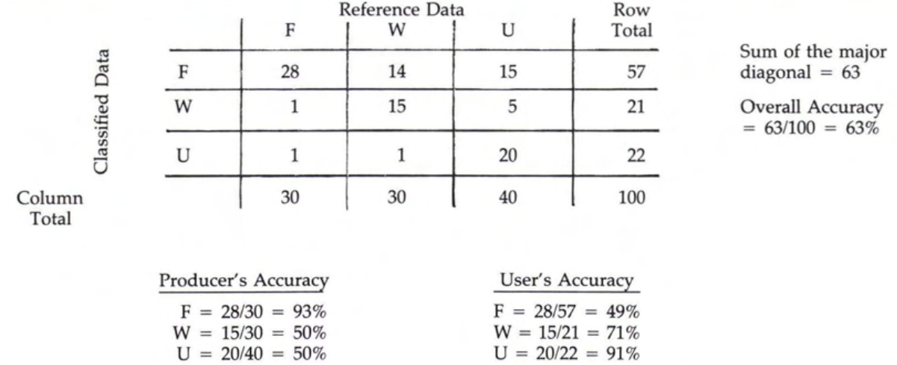

```{r setup, include = FALSE}
    knitr::opts_chunk$set(
    collapse = TRUE,
    comment = "#>"
)
```


```{r work, include = FALSE}

experiment_set <- list(few_cloud         = c("rep_prodes_40", "rep_prodes_41", "rep_prodes_42"),
                       few_masked_clouds = c("rep_prodes_50", "rep_prodes_51", "rep_prodes_52"))

library(dplyr)
library(ggplot2)
library(knitr)
library(magrittr)
library(sits.prodes)
library(xtable)

accuracy_ls <- list()
accuracy_tb <- tibble::tibble()

warning("Run get_experiment_accuracy.R and devtools::build() to update the data in this package!")

validation_data_file <- "extdata/validation_tb.Rdata" %>%
  system.file(package = "sits.prodes") %>% 
  ensurer::ensure_that(file.exists(.))
load(validation_data_file) %>% 
  ensurer::ensure_that(exists("validation_tb"))
accuracy_ls <- validation_tb %>% 
  dplyr::pull(validation_data)
names(accuracy_ls) <- validation_tb %>% 
  dplyr::pull(out_res)

# Get data for confusion matrices.
accuracy_tb <- accuracy_ls %>% 
  names() %>%
    tibble::enframe(name = NULL) %>%
    dplyr::rename("file_path" = "value") %>%
    dplyr::mutate(acc_data = accuracy_ls,
                  experiment = stringr::str_extract(file_path, "rep_prodes_[0-9]+"),
                  algorithm = purrr::map_chr(.$file_path, function(x){
                      unlist(stringr::str_split(stringr::str_extract(x, "results_[a-z]+"), '_'))[2]
                  }),
                  smooth = stringr::str_extract(file_path, "smooth_[0-9]+x[0-9]+_n[0-9]{2}"),
                  scene = stringr::str_extract(basename(file_path), "[0-9]{6}"),
                  pyear = purrr::map_chr(file_path, function(x){
                      as.integer(dplyr::last(unlist(stringr::str_extract_all(basename(x), "[0-9]{4}"))))
                  })) %>%
    dplyr::mutate(smooth = ifelse(is.na(smooth), "no_smooth", smooth)) %>%
    dplyr::select(experiment, algorithm, scene, pyear, smooth, #overall, overall2, up_acc, up_acc2,
                  acc_data, file_path) %>%
    dplyr::mutate(cm = purrr::map(.$acc_data, function(x){return(x$error_matrix)})) %>%
    dplyr::mutate(up_acc2 = purrr::map(accuracy_ls, function(x){
        res <- sits.prodes::asses_accuracy_simple(x$error_matrix)
        c(res$user, res$producer) %>%
            tibble::enframe(name = NULL) %>%
            dplyr::bind_cols(cname =  c(paste0("ua_", names(res$user)), paste0("pa_", names(res$producer)))) %>%
            tidyr::spread("cname", "value") %>%
            return()
    })) %>%
    dplyr::mutate(up_acc3 = purrr::map(.$cm, add_upacc)) %>%
    dplyr::arrange(experiment, algorithm, scene, pyear, smooth)


# get data for graphs
acc_tb <- accuracy_tb %>%
    dplyr::select(experiment, algorithm, scene, pyear, smooth, up_acc2) %>%
    tidyr::unnest() %>%
    tidyr::gather(tidyselect::starts_with("pa_"), tidyselect::starts_with("ua_"),
                  key = "variable", value = "value") %>%
    dplyr::mutate(acc_type = ifelse(stringr::str_sub(variable, 1, 3) == "ua_",
                                    "user", "producer"),
                  variable = stringr::str_sub(variable, 4))
acc_pr <- acc_tb %>% dplyr::filter(acc_type == "producer") %>%
    dplyr::rename(prod_acc = value) %>%
    dplyr::select(-acc_type)
acc_ur <- acc_tb %>% dplyr::filter(acc_type == "user") %>%
    dplyr::rename(user_acc = value) %>%
    dplyr::select(-acc_type)
pa_acc_tb <- acc_pr %>%
    dplyr::inner_join(acc_ur, by = c("experiment", "algorithm", "scene", "pyear",
                                     "smooth", "variable"))

```


```{r brick_desc, echo=FALSE}

suppressWarnings(
   brick_description %>% 
     knitr::kable(digits = 2, row.names = TRUE, full_width = FALSE) %>% 
     kableExtra::kable_styling()
 )

```


## Accuracy

It is a decomposition of the accuracy, originally proposed by Story and Congalton [@Story:1986].
* **Producers' accuracy** (omission error) is how well a specific area on the Earth is mapped. It 
is the probability that a reference sample is correctly classified. 
* **User's accuracy** (or reliability) is how well the map represents what is really on the ground.


```{r, out.width = "600px", echo = FALSE}

```


[TODO] Olafson extended this definition by pointig the need of normalizing the results using the area of on class


## Classification results

### Overall accuracy

* Random forest bahaves homogenously accros experiments, smooths, and scenes.
* Accuracy improvement due to smooth window size is marginal.
* Filling the clouds using  *No Data* decreses Deep Learning's accuracy.


### Accuracy by algorithm and smooth


```{r plot_graphics_algorithm, echo=FALSE, fig.height=5, fig.width=7, results='asis'}

plot_acc_by_alg_smt <- function(data_tb, my_algorithm, my_smooth){
    print(
        data_tb %>%
            dplyr::filter(algorithm == !!my_algorithm, smooth == !!my_smooth) %>%
            ggplot2::ggplot(aes(x = prod_acc, y = user_acc,
                                color = experiment,
                                shape = variable
            )) +
            ggplot2::geom_point() +
            ggplot2::coord_fixed() +
            ggplot2::xlim(0, 1) +
            ggplot2::ylim(0, 1) +
            ggplot2::facet_wrap(scene ~ pyear) +
            ggplot2::labs(title = sprintf("%s %s", my_algorithm, my_smooth),
                          x = "Producer accuracy",
                          y = "User accuracy") +
        ggplot2::theme(axis.text.x = element_text(angle = 90, hjust = 1))
    )
}


for (my_algorithm in c("dl", "rf", "svm", "vote")) {
    cat("\n\n")
    cat(paste0("#### ", my_algorithm), "\n")
    for (my_smooth in c("smooth_3x3_n10", "smooth_5x5_n10", "smooth_7x7_n10",
                  "smooth_9x9_n10","smooth_11x11_n10") ) {
        suppressWarnings(pa_acc_tb %>%
                             plot_acc_by_alg_smt(my_algorithm, my_smooth))
    }
}

```


### Accuracy by label and experiment


```{r plot_graphics_smooth, echo=FALSE, fig.height=7, fig.width=9, results='asis'}

plot_acc_by_alg_xp <- function(data_tb, my_label, my_experiment){
  algorithm <- prod_acc <- user_acc <- NULL
  plot(
    data_tb %>%
      dplyr::filter(variable ==  !!my_label,
                    experiment == !!my_experiment) %>%
      ggplot2::ggplot(aes(x = prod_acc, y = user_acc,
                          color = smooth,
                          shape = algorithm)) +
      ggplot2::geom_point() +
      ggplot2::coord_fixed() +
      #ggplot2::xlim(0, 1) +
      #ggplot2::ylim(0, 1) +
      ggplot2::facet_wrap(scene ~ pyear) +
      labs(title = sprintf("Whole validation %s %s", my_label, my_experiment),
           x = "Producer accuracy",
           y = "User accuracy") +
      ggplot2::theme(axis.text.x = element_text(angle = 90, hjust = 1))
  )
}

for (my_label in c("deforestation", "forest")) {
    cat("\n\n")
    cat(paste0("#### ", my_label), "\n")
    for (my_experiment in c("rep_prodes_40", "rep_prodes_41", "rep_prodes_42",
                    "rep_prodes_50", "rep_prodes_51", "rep_prodes_52")) {
        suppressWarnings(plot_acc_by_alg_xp(pa_acc_tb, my_label, my_experiment))
    }
}


```


### Confusion matrices


```{r confusion_matrix, echo=FALSE, results='asis'}

if (nrow(accuracy_tb) > 0) {
    for (i in 1:nrow(accuracy_tb)) {
        cap <- sprintf("Confusion matrix %s %s %s %s %s ",
                       unlist(accuracy_tb[i, "experiment"]),
                       unlist(accuracy_tb[i, "scene"]),
                       unlist(accuracy_tb[i, "pyear"]),
                       unlist(accuracy_tb[i, "algorithm"]),
                       unlist(accuracy_tb[i, "smooth"]))
        cat(paste0("### ", cap), "\n")
        p_conmat <- suppressMessages(suppressWarnings(accuracy_tb$up_acc3[[i]] %>%
                                                          apply(2, function(x){x/1}) %>%
                                                          tibble::as_tibble(rownames = NA, caption = cap) %>%
                                                          knitr::kable(digits = 2, row.names = TRUE, full_width = FALSE) %>%
                                                          kableExtra::kable_styling()))
        print(p_conmat)
        cat("\n\n")
    }
}

```


# References

