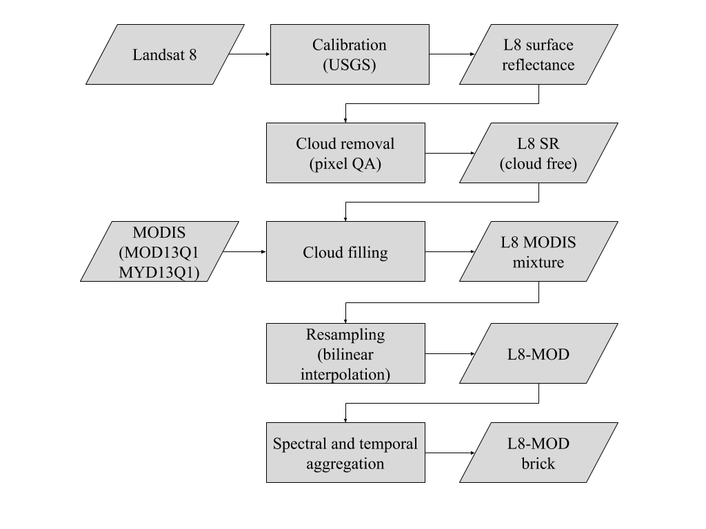

---
title: "StarFM bricks"
author: "Alber Sanchez"
date: "`r Sys.Date()`"
output: 
  html_document:
    toc: TRUE
bibliography: references.bib
editor_options: 
  chunk_output_type: console
vignette: >
%\VignetteIndexEntry{Vignette Title}
  %\VignetteEngine{knitr::rmarkdown}
  %\VignetteEncoding{UTF-8}
  ---
  
  ```{r setup, include = FALSE}
knitr::opts_chunk$set(
collapse = TRUE,
comment = "#>"
)

library(tidyverse)

```


## BRICKS Landsat8 - MODIS

(Text composed for the World Bank report)

Analysing massive datasets of satellite imagery is hard. Even when using a 
single data source, handling thousand of images is a time consuming task. In 
order to ease data management and increase computing performance, we use a data 
cube. A data cube is a set of large computer files of homogeneous spatial, 
temporal, and spectral properties. 

Our data cube is organized into chunks of spatio-temporal data that we call 
bricks. Each brick stores one year of data of a single band (or remote sensing 
index) of the same region using any image format. The data sources for our 
bricks are the Landsat and MODIS satellite programs. 

The Landsat program has continually provided imagery of the Earth surface for 45 
years and it is a long-term program for studying changes in Earth's global 
environment. The most recent mission (Landsat-8) provides visible and thermal 
images of the landmasses on Earth each two weeks at 30m resolution [@Roy:2014; 
@Irons:2012]. 

On the other hand, the MODIS are satellite sensors which record 36 spectral 
bands and produce images every two days. For our bricks, we used two derived 
products of MODIS, known as MOD13Q1[@MOD13Q1] and MYD13Q1[@MYD13Q1], two 
collections used in applications on vegetation researches. These products have 
spatial resolution of 250m and their images are composite of the best pixel of 
two weeks. The imagery dates from 2000 [@Friedl:2002]. Both Landsat-8 and MODIS 
enable scientists to compare and monitor global vegetation parameters such as 
photosynthetic activity and phenological change.

The construction of a brick starts with the raw images taken by the Landsat 
program. Specifically, we use Landsat-8 images which undergo radiometric and 
geometric corrections to compensate for topographic (e.g. relief) and 
atmospheric phenomena (e.g. aerosols). The results are known as surface 
reflectance images, which relate image pixels to precise locations on Earth 
[@Barsi:2014]. This calibration process also identifies clouds and it allows us 
to remove the corresponding pixels. This process is made on demand by the 
Geological Service of the United States of America.

Then we fill the cloud/shadows gaps in the Landsat-8 images using 
MOD13Q1/MYD13Q1 data products. To compensate for the differences in resolution 
and to keep the Landsat-8 structure of the data, we apply a bilinear 
interpolation. Finally, split the images and stack each band or vegetation index 
into a independent raster file. All procedures is summarized in the Figure below.




## Brick issues

- The first bricks were billienarly interpolation to fill in the clouds in 
Landsat 8 images, including the vegetation indexes. They are stored in 
[chronos](/net/150.163.2.38/dados1/Repository/Brick/LC8/LC8SR-MOD13Q1-MYD13Q1)


```{r ndvi_old_bricks, echo=FALSE}

# gdallocationinfo /net/150.163.2.38/dados1/Repository/Brick/LC8/LC8SR-MOD13Q1-MYD13Q1/LC8SR-MOD13Q1-MYD13Q1_233067_2016-08-28_red_STACK_BRICK.tif -valonly -wgs84 -65.22349 -10.12548
red_fst <- c(944, 709, 479, 1136, 788, 614, 2133, 1087, 1179, 2127, 852, 479, 3527, 613, 462, 353, 1081, 405, 441, 469, 715, 984, 1005)
# gdallocationinfo                                     /home/alber/shared/brick_interp/LC8SR-MOD13Q1-MYD13Q1_233067_2016-08-28_red_STACK_BRICK.tif -valonly -wgs84 -65.22349 -10.12548
red_snd <- c(944, 709, 479, 1136, 788, 614, 2133, 1087, 1179, 2127, 852, 479, 3527, 613, 462, 353, 1081, 405, 441, 469, 715, 984, 1005)
# gdallocationinfo                                             /home/alber/shared/brick/LC8SR-MOD13Q1-STARFM_233067_2016-08-10_red_STACK_BRICK.tif -valonly -wgs84 -65.22349 -10.12548
red_sfm <- c(817, 909, 789, 690, 207, 552, 782, 1663, 2260, 4524, 2128, 1803, 461, 3745, 6294, 3723, 3460, 784, 397, 383, 425, 647, 647)  

# gdallocationinfo /net/150.163.2.38/dados1/Repository/Brick/LC8/LC8SR-MOD13Q1-MYD13Q1/LC8SR-MOD13Q1-MYD13Q1_233067_2016-08-28_nir_STACK_BRICK.tif -valonly -wgs84 -65.22349 -10.12548
nir_fst <- c(3129, 3439, 3942, 4199, 3748, 4597, 4422, 4080, 4226, 5192, 4887, 3954, 5735, 4474, 3852, 3390, 4311, 4000, 3544, 3920, 3581, 3235, 2851)
# gdallocationinfo                                     /home/alber/shared/brick_interp/LC8SR-MOD13Q1-MYD13Q1_233067_2016-08-28_nir_STACK_BRICK.tif -valonly -wgs84 -65.22349 -10.12548
nir_snd <- c(3129, 3439, 3942, 4199, 3748, 4597, 4422, 4080, 4226, 5192, 4887, 3954, 5735, 4474, 3852, 3390, 4311, 4000, 3544, 3920, 3581, 3235, 2851)
# gdallocationinfo                                             /home/alber/shared/brick/LC8SR-MOD13Q1-STARFM_233067_2016-08-10_nir_STACK_BRICK.tif -valonly -wgs84 -65.22349 -10.12548
nir_sfm <- c(2627, 2680, 2930, 3455, 2364, 3585, 3727, 4917, 3360, 3438, 3989, 5072, 3951, 4535, 7153, 5746, 4308, 4113, 4002, 4283, 3956, 3564, 3564)

# gdallocationinfo /net/150.163.2.38/dados1/Repository/Brick/LC8/LC8SR-MOD13Q1-MYD13Q1/LC8SR-MOD13Q1-MYD13Q1_233067_2016-08-28_ndvi_STACK_BRICK.tif -valonly -wgs84 -65.22349 -10.12548
ndvi_fst <- c(5401, 6579, 7870, 7888, 7284, 7955, 4497, 7447, 8937, 7418, 7212, 7837, 3833, 8134, 7845, 8281, 8177, 8238, 7974, 8062, 7340, 5333, 4785)
# gdallocationinfo                                     /home/alber/shared/brick_interp/LC8SR-MOD13Q1-MYD13Q1_233067_2016-08-28_ndvi_STACK_BRICK.tif -valonly -wgs84 -65.22349 -10.12548


All NDVI bricks are empty
find /home/alber/shared/brick_interp/ -type f  -name "*ndvi*" -exec gdallocationinfo {}  -valonly -wgs84 -65.22349 -10.12548 \;

ndvi_snd <- c(
0
0
0
0
0
0
0
0
0
0
0
0
0
0
0
0
0
0
0
0
0
0
0)
# gdallocationinfo                                             /home/alber/shared/brick/LC8SR-MOD13Q1-STARFM_233067_2016-08-10_ndvi_STACK_BRICK.tif -valonly -wgs84 -65.22349 -10.12548
ndvi_sfm <- c(5256, 4935, 5757, 6671, 8390, 7331, 6531, 4945, 1957, -1364, 3042, 4755, 7910, 954, 639, 2137, 1092, 6798, 8195, 8358, 8060, 6927, 6927)


vi_tb <- tibble(red      =  c(334, 296, 376, 383), 
                nir      =  c(3452, 3215, 4290, 4994),
                ndvi_old = c(8233, 8308, 8799, 8720),
                ndvi_c   = c(8233, 8308, 8799, 8720)
                ) %>% 
    dplyr::mutate(c_ndvi = (nir - red)/(nir + red ) * 10000)
knitr::kable(vi_tb)

```

```{r ndvi_interpolated_bricks, echo=FALSE}


```


## ------------


Vignettes are long form documentation commonly included in packages. Because they are part of the distribution of the package, they need to be as compact as possible. The `html_vignette` output type provides a custom style sheet (and tweaks some options) to ensure that the resulting html is as small as possible. The `html_vignette` format:

- Never uses retina figures
- Has a smaller default figure size
- Uses a custom CSS stylesheet instead of the default Twitter Bootstrap style

## Vignette Info

Note the various macros within the `vignette` section of the metadata block above. These are required in order to instruct R how to build the vignette. Note that you should change the `title` field and the `\VignetteIndexEntry` to match the title of your vignette.

## Styles

The `html_vignette` template includes a basic CSS theme. To override this theme you can specify your own CSS in the document metadata as follows:

output: 
rmarkdown::html_vignette:
css: mystyles.css

## Figures

The figure sizes have been customised so that you can easily put two images side-by-side. 

```{r, fig.show='hold'}
plot(1:10)
plot(10:1)
```

You can enable figure captions by `fig_caption: yes` in YAML:

output:
rmarkdown::html_vignette:
fig_caption: yes

Then you can use the chunk option `fig.cap = "Your figure caption."` in **knitr**.

## More Examples

You can write math expressions, e.g. $Y = X\beta + \epsilon$, footnotes^[A footnote here.], and tables, e.g. using `knitr::kable()`.

```{r, echo=FALSE, results='asis'}
knitr::kable(head(mtcars, 10))
```

Also a quote using `>`:

> "He who gives up [code] safety for [code] speed deserves neither."
([via](https://twitter.com/hadleywickham/status/504368538874703872))


# References
