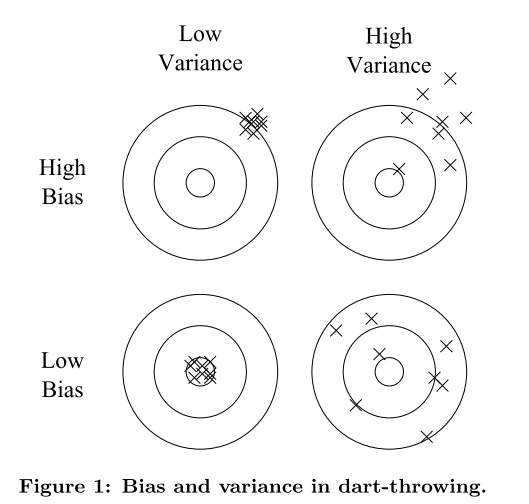

  
  
```{r setup, include = FALSE}
knitr::opts_chunk$set(
collapse = TRUE,
comment = "#>"
)

library(dplyr)
library(ggplot2)
library(kableExtra)
library(knitr)
library(purrr)
library(tidyr)
library(sits.prodes)

# TODO: remove
library(devtools)
devtools::load_all()
devtools::build(vignettes = FALSE, manual = TRUE)
devtools::install()
# - - - 


```


# Bias and variance



**One way to understand overfitting is by decomposing generalization error into bias and variance. Bias is a learner’s tendency to consistently learn the same wrong thing. Variance is the tendency to learn random things irrespective of irrespective of the real signal** - [@Domingos:2012]


# Training

## Experiment summary

```{r echo=FALSE}
warning("Run get_training_logs.R and devtools::build() to update the logs in this package!")
# parse log files
load(system.file("extdata/log_files.Rdata", package = "sits.prodes"))
stopifnot(exists("log_files"))

# parse logs
logs_ls <- system.file(file.path("extdata", log_files), package = "sits.prodes") %>%
    dplyr::as_tibble() %>% dplyr::rename(path = value) %>% 
    dplyr::mutate(experiment = basename(path)) %>% 
    dplyr::select(experiment, path) %>%
    dplyr::mutate(parsed_log = purrr::map(.$path, parse_training_log)) %>% 
    dplyr::mutate(setup = purrr::map(.$parsed_log, 
                              function(x){
                                  x[["header"]] %>%
                                      dplyr::mutate(key = stringr::str_replace_all(key, 
                                          c("\\(" = "", "\\)" = "", " " = "_"))) %>% 
                                      tidyr::spread(key, value) %>%
                                  return()}),
                  trains = purrr::map(.$parsed_log, 
                              function(x){
                                  x[["experiments"]] %>%
                                  lapply(function(y){
                                             y %>% 
                                             dplyr::filter(value != "<environment>") %>%
                                             tidyr::spread(key, value) %>%
                                             return() 
                                         }) %>%
                                  dplyr::bind_rows() %>%
                                  return()
                              })) %>%
    dplyr::select(-parsed_log)

logs_ls %>% tidyr::unnest(setup) %>% 
    dplyr::mutate(bands = paste(Bands_experiment, Bands__experiment)) %>%
    dplyr::mutate(labels = paste(Labels, Labels_experiment)) %>%
    dplyr::select(experiment, Clasification_type, labels, bands, Scenes_experiment) %>%
    knitr::kable() %>% 
    kableExtra::kable_styling(full_width = F) 
```

## Training results


```{r fig.width=9, fig.height=7, echo=FALSE}
plot_tb <- logs_ls %>% tidyr::unnest(trains) %>% dplyr::select(experiment, model_name, acc, loss, val_acc, val_loss) %>%
              dplyr::mutate(acc  = purrr::map(acc,  function(x) eval(parse(text = x))),
                            loss = purrr::map(loss, function(x) eval(parse(text = x))),
                            val_acc  = purrr::map(val_acc, function(x) eval(parse(text = x))),
                            val_loss = purrr::map(val_loss, function(x) eval(parse(text = x))), 
                            val_acc_mean = purrr::map_dbl(val_acc, mean)) 

#plot_tb %>% dplyr::select(experiment, model_name, val_acc_mean) %>%
#    knitr::kable() %>% kableExtra::kable_styling(full_width = F)


plot_ls <- lapply(unique(plot_tb$experiment), function(exp){
  plot_tb %>% dplyr::filter(experiment %in% exp) %>% tidyr::unnest() %>%
    dplyr::group_by(model_name) %>% dplyr::mutate(epoch = row_number()) %>% 
    ggplot2::ggplot() +
    ggplot2::geom_path(aes(y = acc, x = epoch), colour = "blue") +
    ggplot2::geom_path(ggplot2::aes(y = val_acc, x = epoch)) +
    ggplot2::ggtitle(exp) +
    ggplot2::ylim(0.95, 1.0) +
    #ggplot2::theme(plot.title = element_text(size = 8)) +
    ggplot2::labs(x = "Epochs", y = "Accuracy") + 
    ggplot2::facet_wrap(~ model_name, nrow = 5) %>%
    return()
})

for(p in plot_ls)
    suppressWarnings(print(p))

```

## selected trainings
- train_20_model_1
- train_21_model_12
- train_30_model_18
- train_31_model_5
- train_32_model_10
- train_33_model_19
- train_34_model_6
- train_35_model_8
- train_40_model_17
- train_41_model_2
- train_42_model_2
- train_50_model_2
- train_51_model_14
- train_52_model_13

# References
